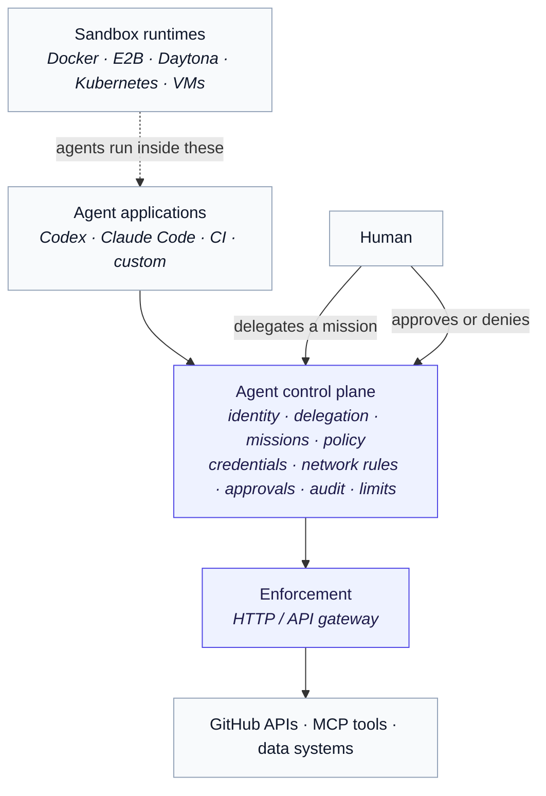
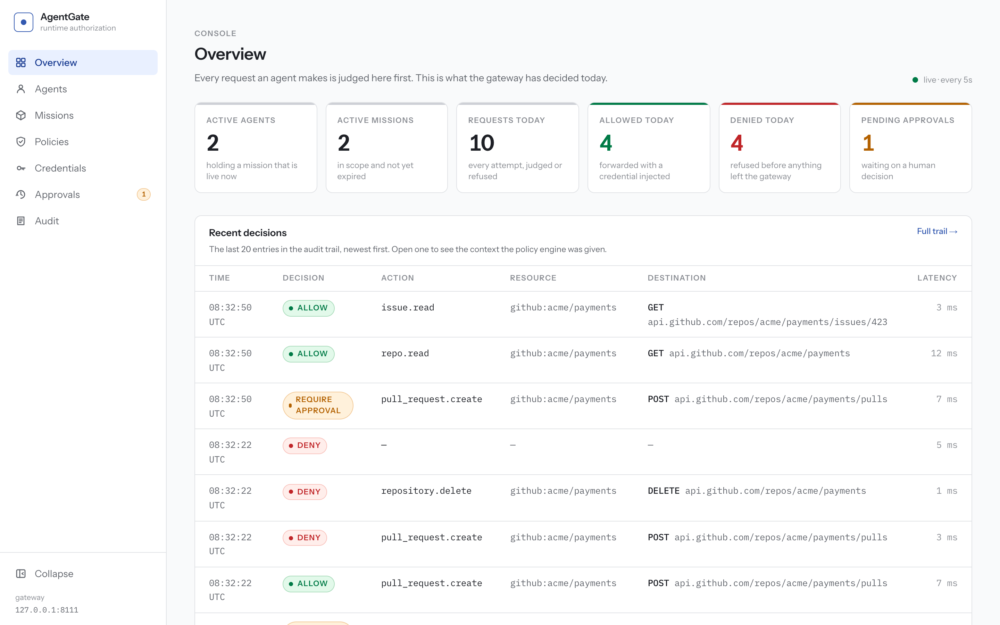
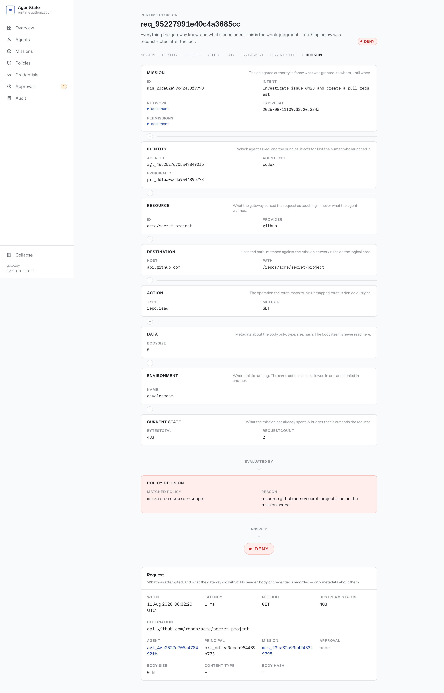
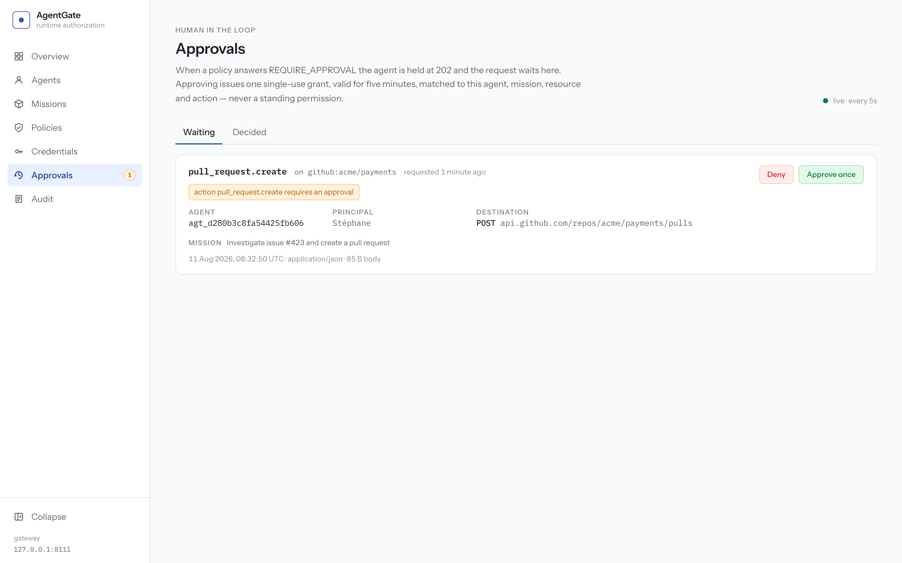
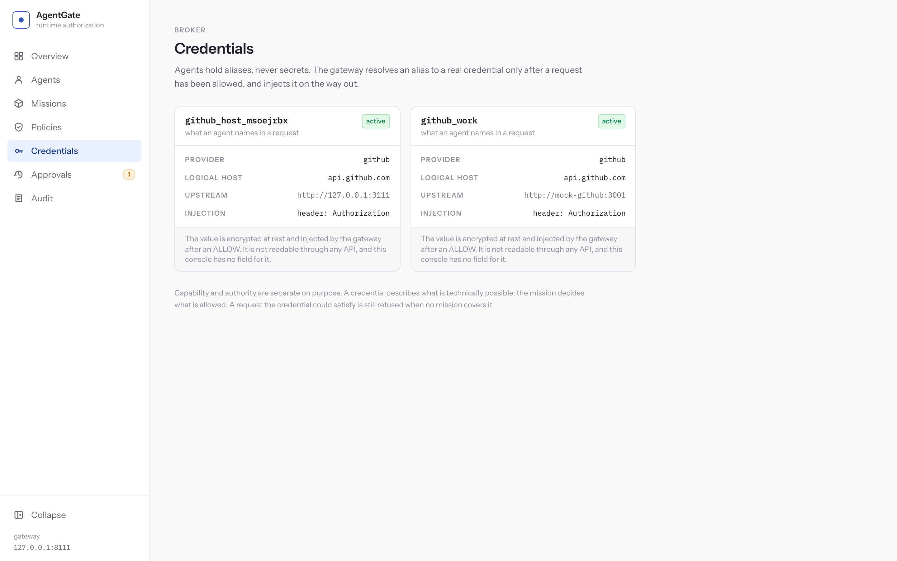
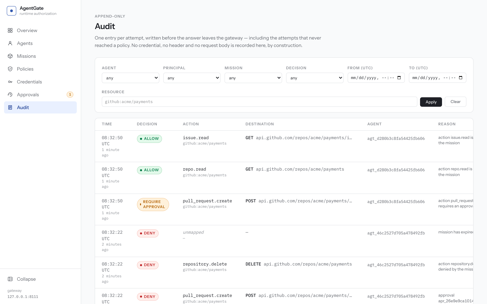

# AgentGate

> **Agents get credentials and network access without ever receiving the actual credentials.**

Runtime authorization for AI agents. AgentGate sits between an agent and the systems it needs to touch, and decides every single action while it happens.

```text
Sandboxing answers: "Where can this agent execute?"
AgentGate answers:  "What can this agent do?"
```

A sandbox is about containment. It stops an agent writing to your home directory or forking bombs, and it does that well. It has no opinion about the agent using a perfectly legitimate GitHub token to delete a repository, because from inside the sandbox that is just an HTTPS request. AgentGate is the layer that has the opinion. It does not compete with the sandbox; it decides what leaves it.

---

## How it works

```text
OBSERVE  →  DECIDE  →  ENFORCE
```

Observing comes first: the agent calls `POST /v1/proxy` with a credential _alias_, a method and a URL, and the gateway parses that request itself to work out what it touches. It never asks the agent what it is doing, and would not believe the answer if offered.

Everything the gateway learned then becomes one structured question, which is the deciding step:

```text
MISSION + IDENTITY + RESOURCE + ACTION + DATA + ENVIRONMENT + CURRENT STATE  →  DECISION
```

The answer is `ALLOW`, `DENY` or `REQUIRE_APPROVAL`, and it is stored as it was asked. A decision can be read back later exactly as it was made rather than reconstructed from a log line.

Enforcement is the last step and the only one where a real credential exists in the process. After ALLOW, the gateway decrypts it, injects it into the outbound request, forwards, and hands back what came back. The agent sees the answer. It never sees the key.

All of it rests on one distinction: a credential defines what is technically possible, and a mission defines what is authorized. The demo's GitHub token can read every repository in the `acme` org. The mission covers one of them. Case 3 is that gap, made visible.

### Architecture



Sandboxes sit _below_ this picture, not beside it. `AI agent → sandbox → AgentGate → external world`.

---

## Quickstart

```bash
git clone <this repo> && cd agentgate
cp .env.example .env        # dev-only secrets, committed on purpose
docker compose up --build   # postgres, gateway, mock GitHub, OPA, console
make demo                   # the seven cases below
```

Then open the console at <http://localhost:3000>.

If 3000, 8080, 5432 or 8181 are already taken on your machine — and 3000 and 8080 usually are — set `WEB_PORT`, `GATEWAY_PORT`, `POSTGRES_PORT` or `OPA_PORT` in `.env` before bringing the stack up. Every one of them is published on `127.0.0.1` only; `GATEWAY_BIND` is the single deliberate way out of that, and [THREAT_MODEL.md](THREAT_MODEL.md) explains what you are accepting when you use it.

For anything past a local demo, run `node scripts/generate-env.mjs` instead of copying the example file, and read the threat model first. Every secret in `.env.example` is in the public repository, including the master encryption key and the admin token.

No Docker? `make demo-host` runs the same demo as local processes against a PostgreSQL you point `DATABASE_URL_TEST` at. Case 0 is the one thing it cannot prove, and it says so instead of passing.

Other targets: `make setup` (install + generate `.env`), `make test` (every suite, leak scan included), `make db-migrate` (migrate both databases from the host), `make db-reset` (drop and rebuild them, reseed the demo), `make reset` (tear down compose and delete its volume).

One warning about `make db-reset`, because it will look broken otherwise. It calls `prisma migrate reset`, and Prisma 7.9.1 refuses that command outright when it detects that a coding agent is driving the shell — Claude Code, Codex, Cursor, Gemini and Copilot all trip it, on an environment variable each of them sets. That is a deliberate guard against an agent dropping a production database, and it is doing its job. Run it from your own terminal instead. If you genuinely need it from inside an agent session, Prisma's error message names the consent variable it wants and expects you to have actually asked the human first.

`make test` starts Postgres through compose before it runs anything, so on a machine without a Docker daemon it stops at the first line. Bring your own Postgres, point `DATABASE_URL_TEST` and `DATABASE_URL_DEMO` at it, then `make db-migrate && pnpm -r test` gets you the same suites.

CI is [`.github/workflows/ci.yml`](.github/workflows/ci.yml): types and formatting, `opa test` and `opa check --strict`, every suite against a real Postgres, the parity suites against a live OPA with a hard failure if either package skipped a single test, and the compose demo followed by a leak scan that reads the container logs.

---

## The demo

Seven cases. One agent, one mission, one alias, and a gateway that answers each request on its own terms. Everything quoted below is real output from `make demo-host` on a freshly seeded database. It is trimmed: the build log at the top, the agent's inherited `PATH` and locale variables, the middle of the mission token, and the `DEMO_MARKER` lines the orchestrator reads to know when to approve and when to expire. Nothing else is cut, and nothing is reworded.

The mission the agent is given ([`apps/gateway/prisma/demo-mission.json`](apps/gateway/prisma/demo-mission.json)):

```yaml
intent: Investigate issue #423 and create a pull request
resources: [github:acme/payments]
allowedActions: [repo.read, issue.read, pull_request.read, branch.create, pull_request.create]
approvalActions: [pull_request.create]
deniedActions: [pull_request.merge, repository.delete]
allowedCredentials: [github_work]
limits: 500 requests, 50 MB, 60 rpm
```

### Case 0 — Network isolation

The agent container sits alone on a Docker network declared `internal: true`. It has no route to the mock GitHub, to the database or to the internet. The gateway is the only address it can reach.

```text
── case 0: Network isolation
SKIPPED: isolation can only be proven inside the compose networks.
  DEMO_MODE=host runs the agent as an ordinary process with ordinary network access.
  Run `make demo` (compose) for this case.
```

That `SKIP` is honest and it is also the current state of this repository: see [Status](#status) below.

### Case 1 — An allowed read

```text
── case 1: Allowed read
GET https://api.github.com/repos/acme/payments/issues/423
→ HTTP 200 (request req_4e063876dfbd4133b58e)
issue #423 [open]: Payment webhook retries duplicate charges
the credential was injected by the gateway; the agent never saw it
```

### Case 2 — What the agent actually holds

The agent dumps its own environment and greps its own filesystem.

```text
── case 2: Secret protection
environment, sorted:
  AGENTGATE_CREDENTIAL=github_host_msoejrbx
  AGENTGATE_TOKEN=eyJhbGciOiJFZERTQSJ9.eyJwcmluY2lwYWxfaWQiOiJwcmlfZGRmZWEw...
  AGENTGATE_URL=http://127.0.0.1:8111
  AGENTGATE_WEB_URL=http://localhost:3000
  DEMO_MODE=host
credential alias: github_host_msoejrbx
the only credential-shaped value above is this mission's own token: it opens one mission,
for one hour, and case 6 ends it
no environment value contains "super-secret": confirmed
scanned 34 files under .../apps/demo-agent for "super-secret": 0 hits
  not read, and therefore not claimed about: 5 symlinks
```

An alias, a gateway URL and a mission token. In the container that is the whole inventory, because the demo agent's environment is built rather than inherited. This is a host run, so the agent also carries whatever the parent shell exported — `PATH` and a locale variable here, and potentially your own secrets on another machine. The case greps every value it finds either way, which is why it can still say what it says.

### Case 3 — A repository the credential could read

```text
── case 3: Unauthorized repository
GET https://api.github.com/repos/acme/secret-project
→ AccessDeniedError [agentgate_access_denied] resource github:acme/secret-project
  is not in the mission scope
the credential can read this repository and the network would carry the request:
the mission's resource scope is what refused it
request req_95227991e40c4a3685cc is in the audit trail as a denial
```

The mission's network rules deliberately allow `GET /repos/acme/**`, so this request is carried all the way to the policy engine and refused _there_. A narrower network rule would have refused it one stage earlier and demonstrated the opposite point.

### Case 4 — A human decides

```text
── case 4: Approval
POST https://api.github.com/repos/acme/payments/pulls — "Fix: Payment webhook retries duplicate charges"
→ 202 approval required: action pull_request.create requires an approval
approval apr_26e9e9ca10144d58b037 is waiting for a human
decide it at http://localhost:3000/approvals
demo: approved apr_26e9e9ca10144d58b037
approval granted; retrying the same request with the grant
→ 201 pull request #991 — https://github.com/acme/payments/pull/991
reuse of approval apr_26e9e9ca10144d58b037 → AccessDeniedError [agentgate_access_denied]
  approval apr_26e9e9ca10144d58b037 has already been used
```

The grant is single-use, expires in five minutes, and is bound to this agent, this mission, this resource and this action. The last line is the demo spending it twice on purpose.

`make demo` approves after two seconds so the run is unattended. Set `DEMO_AUTO_APPROVE=0` and click the button yourself.

### Case 5 — A dangerous action

```text
── case 5: Dangerous action
DELETE https://api.github.com/repos/acme/payments
→ AccessDeniedError [agentgate_access_denied] action repository.delete is denied by the mission
the mission's deniedActions list is what refused it: the reason names repository.delete
no credential was injected: nothing left the gateway
```

### Case 6 — The mission ends

```text
── case 6: Mission expiration
asking the orchestrator to expire the mission
demo: expired mission mis_23ca82a99c42433f9798
after 1 attempt(s), the same request as case 1 is refused:
→ AccessDeniedError [agentgate_mission_expired] mission has expired
```

The agent's token is still cryptographically valid. The mission behind it is not, and the mission is re-checked on every request.

```text
 #  │ Case                    │ Result
────┼─────────────────────────┼────────
 0  │ Network isolation       │ SKIP
 1  │ Allowed read            │ PASS
 2  │ Secret protection       │ PASS
 3  │ Unauthorized repository │ PASS
 4  │ Approval                │ PASS
 5  │ Dangerous action        │ PASS
 6  │ Mission expiration      │ PASS
────┼─────────────────────────┼────────
6 passed, 0 failed, 1 skipped
```

---

## The console

Seven pages, no marketing, no policy logic in React. It is a client of the management API and nothing else.

The Overview is what the gateway decided today.



The runtime decision view is the flagship screen: every term of the authorization formula with the actual data behind it, then the rule that matched, then the answer. The policy input is stored at decision time, so this is the judgment as it was made and not a reconstruction of it.



Approvals is where a human is in the loop. Approve once, or deny.



The Credentials page lists aliases, providers, logical hosts and injection method. There is no field for a value anywhere in this API, so there is nothing here to render by accident.



The Audit trail is the whole thing, newest first, filterable by agent, principal, mission, resource, decision and time range. Every row opens onto the decision view above.



There are also Agents, Missions and Policies pages.

---

## API

The management API lives under `/api/v1`, guarded by `Authorization: Bearer $ADMIN_TOKEN` on every route, including ones that do not exist: an unauthenticated caller cannot tell a real path from a typo.

The OpenAPI 3.1 document is generated from the same zod schemas the routes validate with, so it cannot drift from what the gateway accepts:

- browsable UI: <http://localhost:8080/api/docs>
- document: <http://localhost:8080/api/docs/json>

Those two addresses assume the compose stack, where the gateway is published on `GATEWAY_PORT` and stays up. A `make demo-host` run is different: its gateway binds `DEMO_GATEWAY_PORT` (8099 by default), and the orchestrator kills it when the last case finishes, so there is nothing on either URL by the time you go looking. To browse the document without Docker, start a gateway yourself after `make db-migrate` and leave it running: `set -a && . ./.env && set +a && DATABASE_URL=$DATABASE_URL_DEMO PORT=8080 node apps/gateway/dist/index.js`. The gateway reads no `.env` of its own, which is why the line loads it first — without that prefix it refuses to start, correctly, for want of a master key.

Both are served without the admin token, deliberately, and the trade-off is written up in the threat model. Errors are machine-readable:

```json
{
  "error": "agentgate_access_denied",
  "decision": "DENY",
  "reason": "resource github:acme/secret-project is not in the mission scope",
  "request_id": "req_95227991e40c4a3685cc"
}
```

`request_id` is the same value that appears on the `x-agentgate-request-id` response header and in the audit trail, so any refusal an agent reports can be opened at `/decisions/<request_id>` in the console.

## SDK

```typescript
import { AgentGate, ApprovalRequiredError } from '@agentgate/sdk';

const agentgate = new AgentGate({
  gatewayUrl: process.env.AGENTGATE_URL,
  token: process.env.AGENTGATE_TOKEN,
});

const response = await agentgate.request({
  credential: 'github_work', // an alias, never a secret
  method: 'GET',
  url: 'https://api.github.com/repos/acme/payments/issues/423',
});

console.log(response.json<{ title: string }>().title);
```

When a policy answers REQUIRE_APPROVAL you get an `ApprovalRequiredError` carrying the id to wait on:

```typescript
try {
  await agentgate.request({ credential: 'github_work', method: 'POST', url, body });
} catch (error) {
  if (error instanceof ApprovalRequiredError) {
    await agentgate.waitForApproval(error.approvalId);
    await agentgate.request({
      credential: 'github_work',
      method: 'POST',
      url,
      body,
      approvalId: error.approvalId,
    });
  }
}
```

The SDK has zero runtime dependencies, because it is the one package that ships inside an agent's sandbox. **It is not published to npm.** `private: true` is deliberate, there is no release process behind it, and the version number means nothing. Consume it from this workspace, vendor `dist/`, or write against `POST /v1/proxy` directly; the wire contract is in the OpenAPI document and is the stable part.

---

## Repository layout

```text
apps/
  gateway/      Fastify. Two isolated plugin trees: enforcement (/v1) and management (/api/v1).
                Prisma schema, migrations and seed live here — the console never touches the DB.
  web/          Next.js console. A client of the management API. No policy logic.
  demo-agent/   The agent in the demo. Holds an alias and a token, and nothing else.
packages/
  shared/       Error codes, ids, mission document schemas.
  auth/         Ed25519 mission tokens (mint + verify).
  policy/       PolicyEngine interface, the builtin evaluator, the OPA client,
                URL normalisation, network matching, provider adapters.
  sdk/          The client an agent uses. Zero runtime dependencies.
services/
  mock-github/  Stands in for api.github.com. Demands the token the agent never has.
policies/       agentgate.rego + its tests. Same semantics as the builtin engine.
tests/          Checks that belong to no package: the secret-leak scan, repo invariants.
scripts/        demo-orchestrator.mjs, leak-scan.mjs, generate-env.mjs
```

## Security

[THREAT_MODEL.md](THREAT_MODEL.md) covers every threat in the SPEC's security model with a status marker, and is blunt about what the prototype does not defend. The short version of what you must do before running this anywhere real:

1. Force agent egress through the gateway with something outside AgentGate. Every other guarantee depends on this one.
2. Put authentication in front of the console. It has none of its own.
3. Generate fresh secrets. The committed ones are public.
4. Terminate TLS in front of the gateway.

`scripts/leak-scan.mjs` runs the demo and then greps the transcript, both databases, every management GET, the OpenAPI document, every console page and `docker compose logs` for the upstream token and the admin token. One hit anywhere is a non-zero exit. It runs as part of `make test`, and it writes its verdict to `artifacts/leak-report.txt` as well as to the terminal, with the values themselves redacted out: a scanner that prints the secret into a log everyone can read has leaked it on everyone's behalf.

---

## Status

Built as a prototype against `SPEC.md`. Everything above is real and was executed; this section is what is not.

### Never executed here

The machine this was built on has **no working Docker daemon**. Consequences, all of them unverified rather than broken:

- No image has ever been built. The four Dockerfiles are unproven, including the manifest fixes added alongside the check in `tests/build/`.
- `make demo` (the compose path) has never run. Only `make demo-host` has.
- **Demo case 0 has never executed anywhere.** Network isolation is the one claim with no evidence behind it. The compose file declares `agent-net` as `internal: true`, which is what would make it true.
- `make reset` and `make db-reset` are unrun. `db-reset` shells out to `prisma migrate reset`, which refuses to execute when it detects an AI agent invoking it. That guard was not bypassed. `make db-migrate` _is_ verified, including against a database that was genuinely three migrations behind.
- The leak scan's `docker compose logs` stage skips loudly and says so in its own summary.

Two asymmetries worth knowing even when Docker works: case 0 proves isolation partly by failing to reach `example.com`, which proves nothing on a runner that has no internet either way; and case 2's filesystem scan covers `/app` in the container but only `apps/demo-agent` on the host. The container run is the one that proves something.

### Gaps against SPEC Part 1

- **There is no `policies` resource in the management API.** The SPEC lists one. The console's Policies page derives policy from the missions that exist, which is honest but is not the documented API resource.
- **The console reports the policy engine from its own environment variable**, not from the gateway. A gateway booted with `builtin` while the web container has `POLICY_ENGINE=opa` will display the wrong one, with nothing able to detect it. The page admits this in place.
- **The Agent page cannot show a session.** A `session_id` is minted into every token and returned when a token is minted, but no table stores it, so the field reads "not reported".
- **A denied _resource_ cannot be written the way the SPEC spells it.** `restrictions: - access: github:acme/production-secrets` has no representation; a mission's resource scope is a closed list and everything outside it is denied by default. Same effect, different shape.
- `prisma/` lives in `apps/gateway/prisma/` rather than at the repository root (D15).
- No key rotation, no hash-chained audit rows, no transparent HTTPS proxy, no DLP, no external secret backends, no multi-tenant auth on the management API. All are declared non-goals in SPEC Part 2, listed here so nobody has to go looking.

### Test results

`pnpm -r test` passes 671 and skips 47: mock-github 20, shared 21, auth 13, policy 167 (+46 skipped), gateway 324 (+1 skipped), sdk 25, demo-agent 30, web 63, tests 8.

With `OPA_URL` pointing at a live OPA it is 718 passing and nothing skipped. Those 47 are the parity suites, 46 in `packages/policy` and one in the gateway, which check that `policies/agentgate.rego` and the builtin evaluator reach the same verdict, and they are `skipIf(!OPA_URL)` — so the default way to run them is not to. CI exports the variable and then proves it had an effect, failing the build if either package skipped a single test. Verified in both directions: with OPA running the gate reports zero, without it reports 47 (46 in `packages/policy`, one in the gateway) and fails.

`opa test policies/` is 27 passing and `opa check --strict policies/` is clean, both against OPA 1.19.0, the version compose runs.

The leak scan is clean over a real host-mode run: the demo transcript with every service's own stdout in it, 18 tables across both databases (about 12 MB of JSON), 15 management responses including the OpenAPI document, 10 console pages, and the gateway's log output during the sweep. Its Docker stage skipped, loudly, as described above.

It has also been observed failing on real data, which is the part that makes a clean result mean something. A reviewer put the upstream token into the `intent` of a live mission row and left it there for two minutes. The scan caught all five occurrences it produced, in three different stages: the `Mission` table in the database dump, `GET /api/v1/missions` and `GET /api/v1/missions/{id}`, and the console's `/missions` page twice over, once in the HTML and once in the React payload embedded beneath it. The report named every location and printed the value in none of them.

That run also exposed a gap of its own. Its findings went to stderr through a truncated pipe and were gone before anyone read them, which is why the scan now writes `artifacts/leak-report.txt` on every run.

Three structural greps also come back empty: no module under the enforcement tree imports anything from the management tree, the gateway source contains no `console.log` call (the string appears once, in a comment explaining why a credential does not show up in one), and the upstream token appears nowhere outside `.env.example`, the SPEC, the plan documents, test fixtures and the leak scanner's own list of things to hunt for.

## Roadmap

Adapters are the obvious next axis: AWS, Kubernetes, PostgreSQL, Kafka, MCP. `ProviderAdapter` is a real seam with one implementation behind it, and the pipeline denies anything unmapped rather than falling through, so a second adapter is additive.

Beyond that: a transparent proxy so agents need no SDK, content inspection in the `data` slot the policy input already reserves, external secret backends behind the `SecretStore` interface, and splitting enforcement and management into two listeners so the gateway can be exposed without exposing the admin API.
